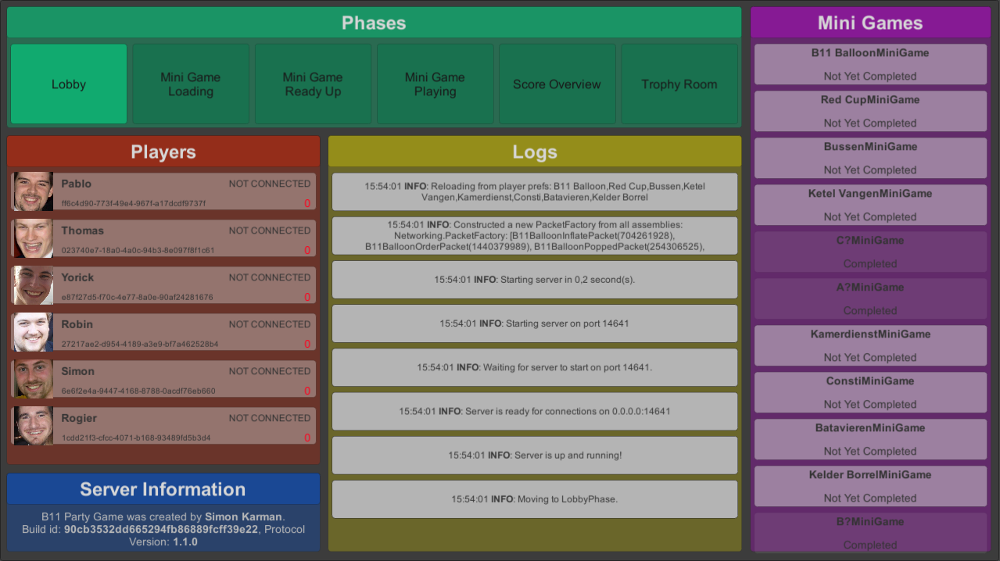
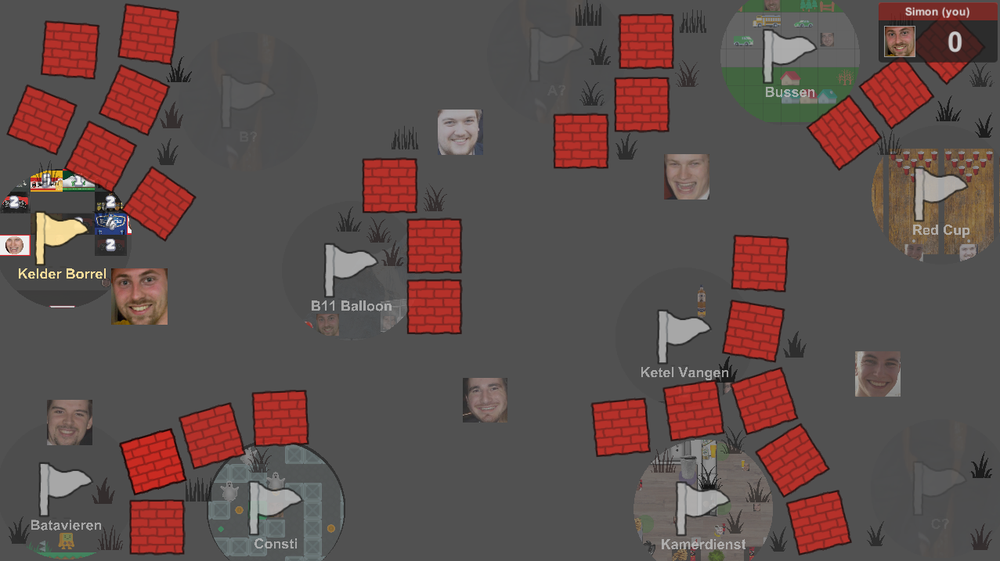
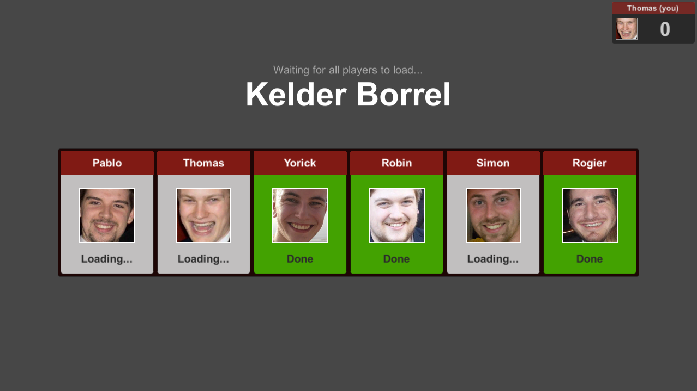
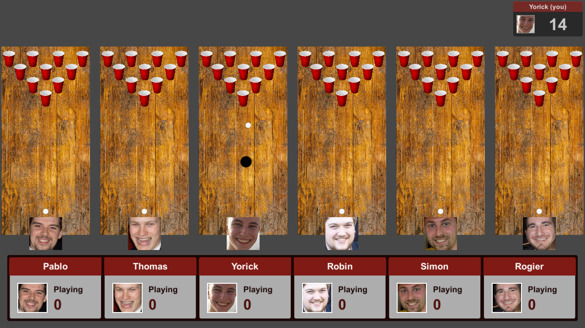
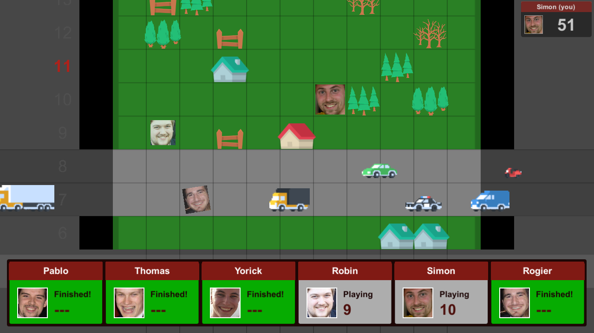
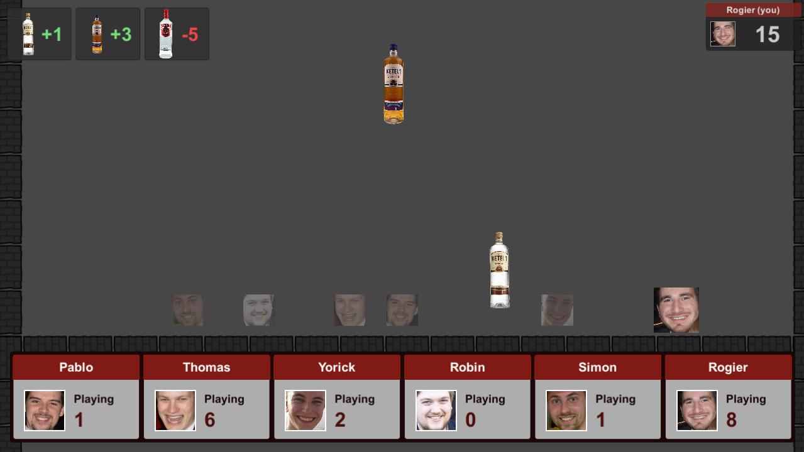
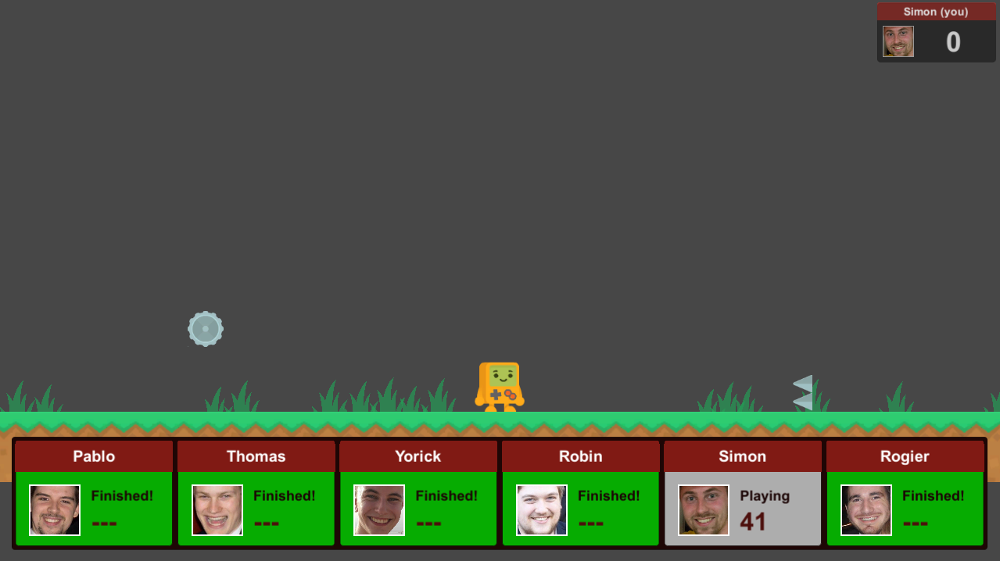

# B11 Party

During the COVID-19 pandamic it can be challenging to keep in touch with friends. This project is a multiplayer game based on Mario Party with minigames themed around the [11th board of study association Sticky](https://svsticky.nl/nl/besturen/11). Its goal is to be able to interact with each other in a virtual world, while competing to reach the highest score by playing minigames. This project was created by [Simon Karman](https://www.simonkarman.nl).

The secondary goal of this project was to create a first demonstrative project for the [karman multiplayer library](https://www.simonkarman.nl/projects/multiplayer). The project is build using version `2020.1` of the Unity3D game engine and the networking code was build using `version 0.1.0` of the [karman multiplayer library](https://www.simonkarman.nl/projects/multiplayer).

## Playing the game
The game was build for windows and linux and the binaries can be downloaded here: [https://karman.dev/b11-party](https://karman.dev/b11-party).

When starting the game you're presented with a login screen. For clients to join a game you will first need a server.

### Starting a server
The server can be run on your own machine and will start on port 14641 (aka 11^4). Make sure to setup port forwarding rules in your router accordingly. To start the server enter the `se-rver` passcode in the passcode field. When starting a server, the address will be ignored and can be left blank.

The server has a UI that shows the current phase the server is in, the clients that are connected, the recent logs that the server made, and the status of all the mini games.

 The only time clients should connect or disconnect is when the server is in the lobby phase. When a client connects during any other phase it will immediatly get kicked from the server. If a client leaves the game during any of the other phases the game my end up in a non working state.
 
 When the server ends up in a state that is incorrect or non responsive, you can hold down the `ESC`-key for 1.5 seconds. This will save the score of the clients and the minigames to disk. After that it will disconnect all the clients and restart the server using this saved state. After this the clients should reconnect to the server. In case you want to entirely reset the server you can hold the `R`-key in combination with the `ESC`-key. This will reset all scores to 0, and all mini games to 'not yet completed'.

### Connecting as a client
To setup a connection to the server as a client you need two things. First is the server adress (ip or dns name) that the person that is hosting the server can provide. Secondly you need a passcode. You have to connect as one of the members from the 11th board of study association Sticky. The following passcodes correspond to the different members:

- Pablo: `pa-1x3d`
- Thomas: `th-89f3`
- Yorick: `yo-y3kl`
- Robin: `ro-bn28`
- Simon: `si-te35`
- Rogier: `ro-g7ac`

> Note: To be able to the play the game you need all six members to join and each member can connect only once.

## Phases
The server goes through a pre defined flow during the course of the game. This flow consists of six different phases. Each phase is explained below.

### Lobby phase
During the lobby phase clients can connect to the game. The clients can walk around through the lobby using the `WASD`/`arrow`-keys.

The lobby shows all the available mini games with a flag. When a client is close to a flag it can press the `SPACE`-key to cast a vote for the corresponding mini game. After voting, a client can no longer move around the lobby. When a mini game has been completed its flag will 'gray-out' to indicate it cannot be voted on again.

Once all clients have voted for a minigame, the minigame with the most votes is chosen. The server will then continue with the next phase.

### Mini game loading phase
During mini game loading phase phase the server send information about the mini game that was chosen to the clients, and the clients can load all assets required for the mini game in to the process. Once all client is done loading it notifies the server. If all clients did that the server will continue with the next phase.

### Mini game ready up phase
During the mini game ready up phase the clients can see a preview of the mini game, a short descrition, and the control schema for the mini game. Once each client is ready to start he or she presses the `SPACE`-key to ready up. Once all clients have readied up, the server will continue with the next phase.

### Mini game playing phase
During the mini game playing phase the actually mini game starts and the clients try to reach the highest possible score. Each mini games has its own rules and gameplay. Some mini games might end when one client has reach a certain goal, other mini games might end only after all clients have either succeeded or failed to reach the goal. Once the mini game ends the server continues with the next phase.

### Score overview phase
During the score overview phase the clients are presented with a score overview with the score of each clients performance in the last played mini game. The scorebars of the clients slowly fill during the course of few seconds. This slowly reveals the different scores of the clients.

This score is added to the total score of the client. The total score of the clients is hidden for the other clients. Each client can however see its own total score at all times in the right top corner of the screen.

After this the server will go back to the lobby phase. If there are no mini games left, the server will continue to the trophy room phase instead.

### Trophy room phase
During the trophy overview phase the clients are presented with their total score over all the mini games. The scorebars of the clients slowly fill over a small period of time to reveale the total scores of the clients. The client with the highest total score wins the game.

## Mini games
The project was build with 11 mini games in mind. At the release of `version 1.0.0` the game contained 4 out of these 11 mini games. Since then, mini games haven been build, and others have not yet been build. The overview below gives an overview of the available mini games and at which point they where added to the game.

### (01/11) B11 Balloon (release 1.0.0)
Make the biggest balloon and ensure it doesn't pop.

### (02/11) Red Cup (release 1.0.0)
Clear the table of all red cups by throwing ping pong balls in them.

### (03/11) Bussen (build - not yet released)
Avoid all busses, trees, houses, fences, ducks, and more on your way to the other side of town.

### (04/11) Ketel Vangen (release 1.0.0)
Catch as many bottles of Ketel One as you can. Catch Ketel One Matuur bottles for bonus points and avoid catching the Smirnoff Ice bottles.

### (05/11) Kelder Racen (-)
Not implemented.

### (06/11) Stickies (-)
Not implemented.

### (07/11) Kamerdienst (build - not yet released)
Collect and deliver all the cookies, beer, coffee, bits, and bananas to the visitors of study association Sticky.

### (08/11) Consti (-)
Not implemented.

### (09/11) Batavieren (release 1.0.0)
Jump over the obstacles passing by and stay on your feet for the longest amount of time.

### (10/11) Borrel (-)
Not implemented.

### (11/11) Fiets (-)
Not implemented.
